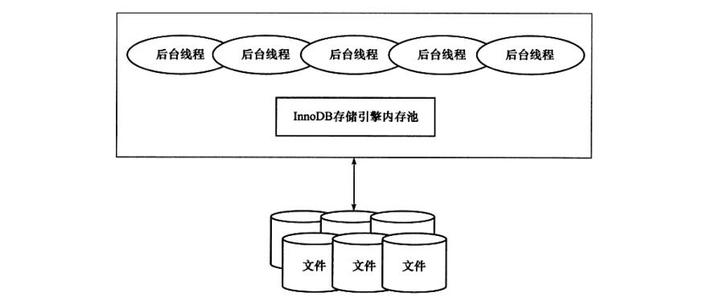
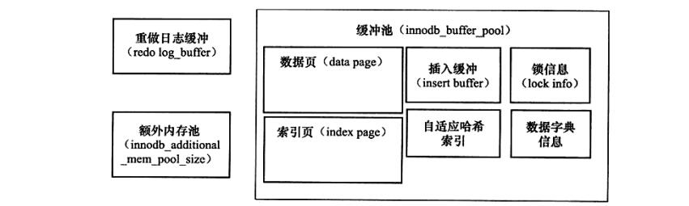

# InnoDB


## 第二章 InonoDB 存储引擎


### 2.3 InnoDB 体系架构

InnoDB 存储引擎有多个内存块，可以认为这些内存块组成了一个大的内存池，负责如下工作：

*   维护所有进程/线程需要访问的多个内部数据结构。
*   缓存磁盘上的数据，方便快速地读取，同时在对磁盘文件的数据修改之前在这里缓存。
*   重做日志（redo log）缓冲。

...



<div align = "center"><strong>图 2-1 &nbsp InnoDB 存储引擎体系架构</strong></div>

**后台线程** 的主要作用是负责刷新内存池中的数据，保证缓冲池中的内存缓存的是最近的数据。此外将已修改的数据文件刷新到磁盘文件，同时保证在数据库发生异常的情况下 InnoDB 能恢复到正常运行状态。


#### 2.3.1 后台线程

InnoDB 存储引擎是 **多线程** 的模型，因此其后台有多个不同的后台线程，负责处理不同的任务。


**1) Master Thread**

Master Thread 是一个非常核心的后台线程，主要负责将缓冲池中的数据异步刷新到磁盘，保证数据的一致性，包括脏页的刷新、合并插人缓冲 (INSERT BUFFER)、UNDO 页的回收等。


**2) IO Thread**

在 InnoDB 存储引擎中大量使用了 AIO (Async IO）来处理写 IO 请求，这样可以极大提高数据库的性能。而 IO Thread 的工作主要是负责这些 IO 请求的 **回调(call back)处理**。

```mysql
show variables like 'innodb_version'\G;		-- InnoDB 版本

/*

*************************** 1. row ***************************
Variable_name: innodb_version
        Value: 5.7.29
1 row in set (0.02 sec)

*/
```

观察 InnoDB 中的 IO Threads：

```mysql
show engine innodb status\G;

/*

*************************** 1. row ***************************
  Type: InnoDB
  Name: 
Status: 
=====================================
2023-04-12 20:38:15 0x7f79f01cb700 INNODB MONITOR OUTPUT
=====================================
Per second averages calculated from the last 21 seconds
-----------------
...
--------
FILE I/O
--------
I/O thread 0 state: waiting for completed aio requests (insert buffer thread)
I/O thread 1 state: waiting for completed aio requests (log thread)
I/O thread 2 state: waiting for completed aio requests (read thread)
I/O thread 3 state: waiting for completed aio requests (read thread)
I/O thread 4 state: waiting for completed aio requests (read thread)
I/O thread 5 state: waiting for completed aio requests (read thread)
I/O thread 6 state: waiting for completed aio requests (write thread)
I/O thread 7 state: waiting for completed aio requests (write thread)
I/O thread 8 state: waiting for completed aio requests (write thread)
I/O thread 9 state: waiting for completed aio requests (write thread)
...
----------------------------
END OF INNODB MONITOR OUTPUT
============================

1 row in set (0.00 sec)


*/
```

可以看到 IO Thread 0 为 **insert buffer thread**。IO Thread 1 为 **log thread**。之后就是根据参数innodb_read_io_threads 及 innodb_write_io_threads 来设置的读写线程，并且读线程的 ID 总是小于写线程。


**3) Purge Thread**

事务被提交后，其所使用的 undolog 可能不再需要，因此需要 PurgeThread 来回收已经使用并分配的 undo 页。

```mysql
show variables like 'innodb_purge_threads'\G;

/*

*************************** 1. row ***************************
Variable_name: innodb_purge_threads
        Value: 4
1 row in set (0.00 sec)


从 InnoDB 1.2 版本开始，InnoDB 支持多个 Purge Thread，这样做的目的是为了进。步加快 undo 页的回收。同时由于 Purge Thread 需要离散地读取 undo 页，这样也能更进一步利用磁盘的随机读取性能。如用户可以设置 4 个 Purge Thread.


*/
```


**4) Page Cleaner Thread**

Page Cleaner Thread 是在 InnoDB 1.2.x 版本中引入的。其作用是将之前版本中脏页的刷新操作都放入到单独的线程中来完成。而其目的是为了减轻原 Master Thread 的工作及对于用户查询线程的阻塞，进一步提高 InnoDB 存储引擎的性能。


#### 2.3.2 内存


**1)  缓冲池**

InnoDB 存储引擎是 **基于磁盘存储** 的，并将其中的记录按照页的方式进行管理。因此可将其视为基于磁盘的数据库系统（Disk-base Database)。在数据库系统中，由于CPU速度与磁盘速度之间的鸿沟，基于磁盘的数据库系统通常使用缓冲池技术来提高数据库的整体性能。

缓冲池简单来说就是一块 **内存区域**，通过内存的速度来弥补磁盘速度较慢对数据库性能的影响。在数据库中进行读取页的操作，首先将从磁盘读到的页存放在缓冲池中，这个过程称为将页 “FIX” 在缓冲池中。下一次再读相同的页时，首先判断该页是否在缓冲池中。若在缓冲池中，称该页在缓冲池中被命中，直接读取该页。否则，读取磁盘上的页。

对于数据库中页的修改操作，则首先修改在缓冲池中的页，然后再以一定的频率刷新到磁盘上。这里需要注意的是，页从缓冲池刷新回磁盘的操作并不是在每次页发生更新时触发，而是通过一种称为 Checkpoint 的机制刷新回磁盘。同样，这也是为了提高数据库的整体性能。


缓冲池配置：

```mysql
show variables like 'innodb_buffer_pool_size'\G;

/*

*************************** 1. row ***************************
Variable_name: innodb_buffer_pool_size
        Value: 134217728
1 row in set (0.01 sec)

134217728 / 1024 / 1024 = 128 M 大小

*/
```


具体来看，缓冲池中缓存的数据页类型有：**索引页**、**数据页**、**undo 页**、**插入缓冲(insert buffer)**、**自适应哈希索引(adaptive hash index)**、**InnoDB 存储的锁信息（lockinfo)**、**数据字典信息（data dictionary）**等。不能简单地认为，缓冲池只是缓存索引页和数据页，它们只是占缓冲池很大的一部分而已。



<div align = "center"><strong>图 2-2 &nbsp InnoDB 内存数据对象</strong></div>

查看缓冲池实例个数：

```mysql
show variables like 'innodb_buffer_pool_instances'\G;

/*

*************************** 1. row ***************************
Variable_name: innodb_buffer_pool_instances
        Value: 1
1 row in set (0.00 sec)

默认的缓冲池实例的个数

*/
```


查看缓冲池使用状态：

```mysql
use information_schema;
select pool_id, pool_size, free_buffers, database_pages 
from innodb_buffer_pool_stats\G;

/*

*************************** 1. row ***************************
       pool_id: 0
     pool_size: 8191
  free_buffers: 7935
database_pages: 256
1 row in set (0.00 sec)


*/
```


**2) LRU List、Free List 和 Flush List** 

通常来说，数据库中的缓冲池是通过 **LRU** ( Latest Recent Used，最近最少使用）算法来进行管理的。即最频繁使用的页在 LRU 列表的前端，而最少使用的页在 LRU 列表的尾端。当缓冲池不能存放新读取到的页时，将首先释放 LRU 列表中尾端的页。

在 InnoDB 存储引擎中，缓冲池中页的大小默认为16KB，同样使用 LRU 算法（优化版）对缓冲池进行管理。

InnoDB 的存储引擎中，LRU 列表中还加入了 midpoint 位置。新读取到的页，虽然是最新访问的页，但并不是直接放入到LRU 列表的首部，而是放入到 LRU 列表的 midpoint 位置。

```mysql
show variables like 'innodb_old_blocks_pct'\G;

/*

*************************** 1. row ***************************
Variable_name: innodb_old_blocks_pct
        Value: 37				
1 row in set (0.00 sec)


*/
```

从上面的例子可以看到，参数 innodb_old_blocks _pct 默认值为 37，表示新读取的页插人到 LRU 列表尾端的 37% 的位置（差不多 3/8 的位置)。在 InnoDB 存储引擎中，把 midpoint 之后的列表称为 old 列表，之前的列表称为 new 列表。可以简单地理解为 new 列表中的页都是最为活跃的热点数据。

若直接将读取到的页放入到 LRU 的首部，那么某些 SQL 操作可能会使缓冲池中的页被刷新出，从而影响缓冲池的效率。

常见的这类操作为索引或数据的扫描操作。这类操作需要访问表中的许多页，甚至是全部的页，而这些页通常来说又仅在这次查询操作中需要，并不是活跃的热点数据。如果页被放入 LRU 列表的首部，那么非常可能将所需要的热点数据页从LRU 列表中移除，而在下一次需要读取该页时，InnoDB 存储引擎需要再次访问磁盘。


为了解决这个问题，InnoDB 存储引擎引入了另一个参数来进一步管理 LRU 列表，这个参数是 **innodb_old_blocks_time**，用于表示页读取到 mid 位置后需要等待多久才会被加人到 LRU 列表的热端。因此当需要执行上述所说的 SQL 操作时，可以通过下面的方法尽可能使 LRU 列表中热点数据不被刷出。

```mysql
show variables like 'innodb_old_blocks_time'\G;

/*

*************************** 1. row ***************************
Variable_name: innodb_old_blocks_time
        Value: 1000							默认是 1000 s
1 row in set (0.00 sec)

*/


-- set global innodb_old_blocks_time=1000;		设置等待时间
-- set global innodb_old_blocks_pct=20;			减少热点页可能刷出的概率
/*

改成 20 也就是新的页被插入到尾端 20% 的位置，前面的 80% 页可能安全

*/
```

注意︰执行命令 SHOW ENGINE INNODB STATUS 显示的不是当前的状态，而是过去某个时间范围内 InnoDB 存储引擎的状态。


LRU 列表用来管理已经读取的页，但当数据库刚启动时，LRU 列表是空的，即没有任何的页。这时页都存放在Free 列表中。当需要从缓冲池中分页时，首先从 Free 列表中查找是否有可用的空闲页，若有则将该页从 Free 列表中删除，放人到 LRU 列表中。

```mysql
/*
...
Buffer pool size   8191					总共的页数
Free buffers       7935					当前 Free 列表中页的个数
Database pages     256					LRU 列表中页的数量
Old database pages 0
Modified db pages  0					脏页数量
Pending reads      0
Pending writes: LRU 0, flush list 0, single page 0
Pages made young 0, not young 0			 pages made young -> LRU 列表中页移动到前端的次数
0.00 youngs/s, 0.00 non-youngs/s
Pages read 221, created 35, written 39
0.00 reads/s, 0.00 creates/s, 0.00 writes/s
No buffer pool page gets since the last printout
Pages read ahead 0.00/s, evicted without access 0.00/s, Random read ahead 0.00/s
LRU len: 256, unzip_LRU len: 0			压缩页

...


可能的情况是 Free buffers 与 Database pages 的数量之和不等于 Buffer pool size。因为缓冲池中的页还可能会被分配给自适应哈希索引、Lock 信息、Insert Buffer 等页，而这部分页不需要 LRU 算法进行维护，因此不存在于 LRU 列表中。


*/
```


查看缓冲池运行状态：

```mysql
select pool_id, hit_rate, pages_made_young, pages_not_made_young 
from information_schema.innodb_buffer_pool_stats\G;

/*

*************************** 1. row ***************************
             pool_id: 0
            hit_rate: 0
    pages_made_young: 0
pages_not_made_young: 0
1 row in set (0.00 sec)

可以多次去测试

*/
```


查看每个 LRU 列表中每个页的具体信息：

```mysql
use information_schema;
select table_name, space, page_number, page_type
from innodb_buffer_page_lru 
where space=1;

/*

Empty set (0.00 sec)		没查到啥..

*/

```


在 LRU 列表中的页被修改后，称该页为 **脏页**（dirty page)，即缓冲池中的页和磁盘上的页的数据产生了不一致。这时数据库会通过 CHECKPOINT 机制将脏页刷新回磁盘，而 **Flush 列表** 中的页即为脏页列表。需要注意的是，脏页既存在于 LRU 列表中，也存在于 Flush 列表中。LRU 列表用来管理缓冲池中页的可用性，Flush 列表用来管理将页刷新回磁盘，二者互不影响。

脏页同样存在于 LRU 列表中，修改查找条件即可：

```mysql
select table_name, space, page_number, page_type
from innodb_buffer_page_lru 
where oldest_modification > 0;

/*

Empty set (0.00 sec)		啥也没有..

*/
```


**3) 重做日志文件**

从图 2-2 可以看到，InnoDB 存储引擎的内存区域除了有缓冲池外，还有 **重做日志缓冲(redo log buffer)**。InnoDB 存储引擎首先将重做日志信息先放入到这个缓冲区，然后按一定频率将其刷新到重做日志文件。重做日志缓冲一般不需要设置得很大，因为一般情况下每一秒钟会将重做日志缓冲刷新到日志文件，因此用户只需要保证每秒产生的事务量在这个缓冲大小之内即可。

```mysql
show variables like 'innodb_log_buffer_size'\G;

/*

*************************** 1. row ***************************
Variable_name: innodb_log_buffer_size
        Value: 16777216							这里默认是 16 MB
1 row in set (0.00 sec)

*/
```

重做日志在下列三种情况下会将重做日志缓冲中的内容刷新到外部磁盘的重做日志文件中：

*   Master Thread 每一秒将重做日志缓冲刷新到重做日志文件;
*   每个事务提交时会将重做日志缓冲刷新到重做日志文件;
*   当重做日志缓冲池剩余空间小于 1/2 时，重做日志缓冲刷新到重做日志文件。


**4) 额外的内存池**

额外的内存池通常被 DBA 忽略，他们认为该值并不十分重要，事实恰恰相反，该值同样十分重要。在 InnoDB 存储引擎中，对内存的管理是通过一种称为 **内存堆（heap)** 的方式进行的。在对一些数据结构本身的内存进行分配时，需要从额外的内存池中进行申请，当该区域的内存不够时，会从缓冲池中进行申请。例如，分配了缓冲池（innodb_buffer_pool)，但是每个缓冲池中的帧缓冲(frame buffer）还有对应的缓冲控制对象(buffer control block)，这些对象记录了一些诸如 LRU、锁、等待等信息，而这个对象的内存需要从额外内存池中申请。因此，在申请了很大的 InnoDB 缓冲池时，也应考虑相应地增加这个值。


### 2.4 Checkpoint 技术

页的操作首先都是在缓冲池中完成的。如果一条 DML 语句，如 Update 或 Delete 改变了页中的记录，那么此时页是脏的，即缓冲池中的页的版本要比磁盘的新。数据库需要将新版本的页从缓冲池刷新到磁盘。

倘若每次一个页发生变化，就将新页的版本刷新到磁盘，那么这个开销是非常大的。若热点数据集中在某几个页中，那么数据库的性能将变得非常差。同时，如果在从缓冲池将页的新版本刷新到磁盘时发生了宕机，那么数据就不能恢复了。

为了避免发生数据丢失的问题，当前事务数据库系统普遍都采用了 **Write Ahead Log** 策略，即当事务提交时，先写重做日志，再修改页。当由于发生宕机而导致数据丢失时，通过重做日志来完成数据的恢复。这也是事务ACID中 D ( **Durability持久性**）的要求。


如果重做日志可以无限地增大，同时缓冲池也足够大，能够缓冲所有数据库的数据，那么是不需要将缓冲池中页的新版本刷新回磁盘。因为当发生宕机时，完全可以通过重做日志来恢复整个数据库系统中的数据到宕机发生的时刻。但是这需要两个前提条件：

*   缓冲池可以缓存数据库中所有的数据；
*   重做日志可以无限增大。

这明显是不现实的。


因此 **Checkpoint (检查点）**技术的目的是解决以下几个问题：

*   缩短数据库的恢复时间；
*   缓冲池不够用时，将脏页刷新到磁盘；
*   重做日志不可用时，刷新脏页。

1)   当数据库发生宕机时，数据库不需要重做所有的日志，因为 Checkpoint 之前的页都已经刷新回磁盘。故数据库只需对 Checkpoint 后的重做日志进行恢复。这样就大大缩短了恢复的时间。
2)   此外，当缓冲池不够用时，根据 LRU 算法会溢出最近最少使用的页，若此页为脏页，那么需要强制执行Checkpoint，将脏页也就是页的新版本刷回磁盘。
3)   重做日志是循环使用的，因此需要强制产生 Checkpoint，将缓冲池中的页刷新到当前重做日志的位置，以产生可用的重做日志。


### 2.5 Master Thread 工作方式


### 2.6 InnoDB 关键特性

InnoDB 存储引擎的关键特性包括：

*   插入缓冲(Insert Buffer)
*   两次写(Double Write)
*   自适应哈希索引(Adaptive Hash Index)
*   异步IO (Async IO)
*   刷新邻接页(Flush Neighbor Page)

### 2.7 启动、关闭与恢复


## 第三章 文件

本章将分析构成 MySQL 数据库和 InnoDB 存储引擎表的各种类型文件。这些文件有以下这些。

*   参数文件：

    告诉 MySQL 实例启动时在哪里可以找到数据库文件，并且指定某些初始化参数，这些参数定义了某种内存结构的大小等设置，还会介绍各种参数的类型。

*   日志文件：

    用来记录MySQL实例对某种条件做出响应时写入的文件，如错误日志文件、二进制日志文件、慢查询日志文件、查询日志文件等。

*   socket文件：

    当用UNIX域套接字方式进行连接时需要的文件。pid文件:MySQL实例的进程ID文件。

*   MySQL表结构文件：

    用来存放MySQL表结构定义文件。

*   存储引擎文件：

    因为MySQL表存储引擎的关系，每个存储引擎都会有自己的文件来保存各种数据。这些存储引擎真正存储了记录和索引等数据。本章主要介绍与InnoDB有关的存储引擎文件。

### 3.1 参数文件

当 MySQL 实例启动时，数据库会先去读一个配置参数文件，用来寻找数据库的各种文件所在位置以及指定某些初始化参数，这些参数通常定义了某种内存结构有多大等。在默认情况下，MySQL 实例会按照一定的顺序在指定的位置进行读取，用户只需通过命令 **`mysql--help | grep my.cnf`** 来寻找即可。

MySQL 实例可以不需要参数文件，这时所有的参数值取决于编译 MySQL 时指定的默认值和源代码中指定参数的默认值。

#### 3.1.1 什么是参数

简单地说，可以把数据库参数看成一个 **键/值 (key/value) 对**。如 **`innodb_buffer_pool_size=1G`**.

```mysql
use information_schema;
/*

select * 
from global_variables
where variable_name like 'innodb_buffer%'\G; 	似乎有点问题

*/

show variables like 'innodb_buffer%'\G;			-- 推荐使用 show variables 命令，各版本都支持
/*

...
*************************** 10. row ***************************
Variable_name: innodb_buffer_pool_size
        Value: 134217728

*/
```


#### 3.1.2 参数类型

MySQL数据库中的参数可以分为两类：

*   动态（dynamic）参数
*   静态(static）参数

动态参数意味着可以在 MysQL 实例运行甲进行更改，**静态参数** 说明在整个实例生命周期内都不得进行更改，就好像是 **只读(read only)** 的。可以通过 **SET** 命令对动态的参数值进行修改，SET 的语法如下：

```mysql
set
| [global | session] system_var_name = expr
| [@@global. | @@session. | @@] system_var_name = expr
```

这里可以看到 global 和 session 关键字，它们表明该参数的修改是基于当前会话还是整个实例的生命周期。有些动态参数只能在会话中进行修改，如 autocommit；而有些参数修改完后，在整个实例生命周期中都会生效，如 binlog_cache_size；而有些参数既可以在会话中又可以在整个实例的生命周期内生效，如 read_buffer_size。

```mysql
select @@session.read_buffer_size\G;
select @@global.read_buffer_size\G;

/*

*************************** 1. row ***************************
@@session.read_buffer_size: 131072
1 row in set (0.00 sec)

*************************** 1. row ***************************
@@global.read_buffer_size: 131072
1 row in set (0.00 sec)

*/

set read_buffer_size=524288;

/*

*************************** 1. row ***************************
@@session.read_buffer_size: 524288			当前会话的参数值变了，改成 512 KB
1 row in set (0.00 sec)

*************************** 1. row ***************************
@@global.read_buffer_size: 131072			全局的值没变，还是 128 KB

*/
```

也就是说如果有另一个会话登录到 MySQL 实例，它的 read_buffer_size 的值是 128 KB，而不是 512 KB。

```mysql
set @@global.read_buffer_size = 1048576;

/*

*************************** 1. row ***************************
@@session.read_buffer_size: 524288			当前会话值没变
1 row in set (0.00 sec)

*************************** 1. row ***************************
@@global.read_buffer_size: 1048576			全局值变成 1 MB
1 row in set (0.00 sec)

*/
```

这里需要注意的是，对变量的全局值进行了修改，在这次的 **实例生命周期内** 都有效，但 MySQL 实例本身并不会对参数文件中的该值进行修改。也就是说，在下次启动时 MySQL 实例还是会读取参数文件。若想在数据库实例下一次启动时该参数还是保留为当前修改的值，那么用户必须去修改参数文件。

```mysql
/*

quit 重新登录

*************************** 1. row ***************************
@@session.read_buffer_size: 1048576
1 row in set (0.00 sec)

*************************** 1. row ***************************
@@global.read_buffer_size: 1048576			都变成全局的值
1 row in set (0.00 sec)

reboot 重启

*************************** 1. row ***************************
@@session.read_buffer_size: 131072			都回来了
1 row in set (0.00 sec)

*************************** 1. row ***************************
@@global.read_buffer_size: 131072
1 row in set (0.00 sec)

*/
```


对静态变量进行修改：

```mysql
set global datadir = '/db/mysql';

/*

ERROR 1238 (HY000): Variable 'datadir' is a read only variable		报错

*/
```


### 3.2 日志文件

日志文件记录了影响 MySQL 数据库的各种类型活动。MySQL 数据库中常见的日志文件有：

*   错误日志 (error log) 
*   二进制日志 (binlog)
*   慢查询日志 (slow query log)
*   查询日志 (log)


#### 3.2.1 错误日志

错误日志文件对 MySQL 的启动、运行、关闭过程进行了记录。MySQL DBA 在遇到问题时应该首先查看该文件以便定位问题。该文件不仅记录了所有的错误信息，也记录一些警告信息或正确的信息。用户可以通过命令**` SHOW VARIABLES LIKE 'log_error' `**来定位该文件，如：

```mysql
show variables like 'log_error'\G;

/*

*************************** 1. row ***************************
Variable_name: log_error
        Value: /var/log/mysql/error.log
1 row in set (0.02 sec)

2023-04-13T08:43:06.315330Z 3 [Note] Access denied for user 'root'@'localhost' (using password: YES)	输入错误密码连接数据库

2023-04-13T08:45:25.808288Z 4 [Note] Access denied for user 'root'@'localhost' (using password: NO)		没有输入密码连接数据库

*/
show variables like 'log_timestamps%'\G;

/*

*************************** 1. row ***************************
Variable_name: log_timestamps
        Value: UTC				  UTC 时间
1 row in set (0.00 sec)

*/

set global log_timestamps = system;		-- 修改成本地时间

/*

2023-04-13T19:29:44.210624+08:00 5 [Note] Access denied for user 'root'@'localhost' (using password: NO)					这个时间才对了啊

配上文件
/etc/mysql/mysql.conf.d/mysqld.cnf 里改

*/

```


#### 3.2.2 慢查询日志

**慢查询日志 (slow log）**可帮助 DBA 定位可能存在问题的 SQL 语句，从而进行 SQL 语句层面的优化。例如，可以在 MySQL 启动时设一个阈值，将运行时间超过该值的所有 SQL 语句都记录到慢查询日志文件中。DBA 每天或每过一段时间对其进行检查，确认是否有 SQL 语句需要进行优化。该阈值可以通过参数 **`long_query_time`** 来设置，默认值为 10，代表 10 秒。

在默认情况下，MySQL数据库并不启动慢查询日志，用户需要手工将这个参数设为 ON：

```mysql
show variables like 'long_query_time'\G;

/*

*************************** 1. row ***************************
Variable_name: long_query_time
        Value: 10.000000			默认 10 秒
1 row in set (0.01 sec)

*/

mysql> show variables like 'slow_query%';

/*

+---------------------+------------------------------------+
| Variable_name       | Value                              |
+---------------------+------------------------------------+
| slow_query_log      | OFF                                |
| slow_query_log_file | /var/lib/mysql/ubuntu1604-slow.log |
+---------------------+------------------------------------+
2 rows in set (0.00 sec)

默认慢查询是关的

*/

mysql> select * from mysql.slow_log;

-- Empty set (0.01 sec)		没东西
```


```shell
# 进不去 /var/lib/mysql/

siuving@ubuntu1604:/var/lib$ ll | grep mysql


# drwxr-x---  6 mysql         mysql         4096 4月  13 16:36 mysql/
# drwxrwx---  2 mysql         mysql         4096 4月   7 22:07 mysql-files/
# drwxr-x---  2 mysql         mysql         4096 4月   7 22:07 mysql-keyring/

# 改一下权限

siuving@ubuntu1604:/var/lib$ sudo chmod 777 mysql
siuving@ubuntu1604:/var/lib$ ll | grep mysql

# drwxrwxrwx  6 mysql         mysql         4096 4月  13 16:36 mysql/
# drwxrwx---  2 mysql         mysql         4096 4月   7 22:07 mysql-files/
# drwxr-x---  2 mysql         mysql         4096 4月   7 22:07 mysql-keyring/

siuving@ubuntu1604:/var/lib/mysql$ ls
# auto.cnf         ib_buffer_pool  mydb                server-cert.pem
# ca-key.pem       ibdata1         mysql               server-key.pem
# ca.pem           ib_logfile0     performance_schema  sys
# client-cert.pem  ib_logfile1     private_key.pem
# client-key.pem   ibtmp1          public_key.pem			里面也没东西啊 :(
```


#### 3.2.3 查询日志

查询日志记录了所有对 MySQL 数据库请求的信息，无论这些请求是否得到了正确的执行。默认文件名为：**主机名.log**。如查看一个查询日志：

```mysql
mysql> show variables like 'general_log';

/*

+---------------+-------+
| Variable_name | Value |
+---------------+-------+
| general_log   | OFF   |
+---------------+-------+
1 row in set (0.00 sec)

查询日志的记录存放的表，没开

*/ 

set global general_log = on;

show variables like 'general_log_file';		-- 看看在哪

/*

+------------------+-------------------------------+
| Variable_name    | Value                         |
+------------------+-------------------------------+
| general_log_file | /var/lib/mysql/ubuntu1604.log |
+------------------+-------------------------------+
1 row in set (0.00 sec)


2023-04-13T20:11:56.368245+08:00	    2 Query	show variables like 'general_log_file'
2023-04-13T20:13:04.040212+08:00	    2 Query	show databases
2023-04-13T20:13:10.396189+08:00	    2 Query	SELECT DATABASE()
2023-04-13T20:13:10.408226+08:00	    2 Init DB	mydb
2023-04-13T20:13:10.408850+08:00	    2 Query	show databases
2023-04-13T20:13:10.409121+08:00	    2 Query	show tables
2023-04-13T20:13:10.409272+08:00	    2 Field List	user 
2023-04-13T20:13:21.368120+08:00	    2 Query	show tables
2023-04-13T20:13:27.607998+08:00	    2 Query	select * from user	

*/

set global general_log = off;			-- 关了算了
```


#### 3.2.4 二进制日志

**二进制日志（binary log）**记录了对 MySQL 数据库执行更改的所有操作，但是不包括 SELECT 和 SHOW 这类操作，因为这类操作对数据本身并没有修改。然而，若操作本身并没有导致数据库发生变化，那么该操作可能也会写入二进制日志。例如：

```mysql
create database test;
create table users
(
    username char(20) not null ,
    score int null
);
insert into users(username, score)
values('siuving', 100);

show mater status\G;		-- 没啥反应，单机有关？

show variables like 'datadir';


-- 有时间可以把这些过一遍
```


如果用户想记录 SELECT 和 SHOW 操作，那只能使用查询日志，而不是二进制日志。此外，二进制日志还包括了执行数据库更改操作的时间等其他额外信息。总的来说，二进制日志主要有以下几种作用：

*   **恢复 (recovery)**：某些数据的恢复需要二进制日志，例如，在一个数据库全备文件恢复后，用户可以通过二进制日志进行 point-in-time 的恢复。
*   **复制 (replication)**：其原理与恢复类似，通过复制和执行二进制日志使一台远程的 MySQL 数据库（一般称为slave 或 standby）与一台 MySQL 数据库（一般称为 master 或 primary）进行实时同步。
*   **审计 (audit)**：用户可以通过二进制日志中的信息来进行审计，判断是否有对数据库进行注入的攻击。


### 3.3 套接字文件

前面提到过，在 UNIX 系统下本地连接 MySQL 可以采用 UNIX 域套接字方式，这种方式需要一个套接字（socket）文件。套接字文件可由参数 socket 控制。一般在 /tmp 目录下，名为 mysql.sock：

```mysql
mysql> show variables like 'socket'\G;

/*

*************************** 1. row ***************************
Variable_name: socket
        Value: /var/run/mysqld/mysqld.sock
1 row in set (0.00 sec)

*/
```

